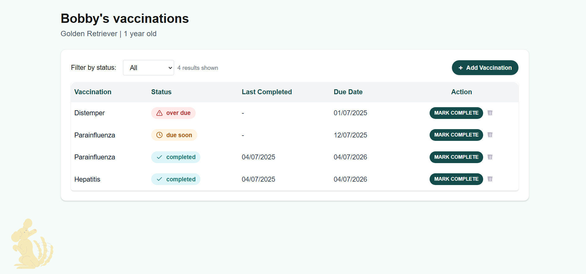

# 🐾 Pet Vaccination Tracker

A modern, full-stack web application to track pet vaccinations. Built with:

- **Next.js 14+ (App Router)**
- **TypeScript**
- **Tailwind CSS**
- **Prisma (SQLite)**
- **REST API routes**

---

## ✨ Features

- View all vaccinations in a responsive table
- Add new vaccinations with due dates
- Mark vaccinations as completed (auto-calculates next due date)
- Status logic: **completed**, **due soon**, **overdue**
- Filter vaccinations by status (dropdown: All, Completed, Due Soon, Overdue)
- Delete vaccinations (with icon)
- Fully responsive for mobile, tablet, and desktop
- **Decorative dog illustration** in the bottom-left for visual polish

### Bonus Features

- Status-based filtering (dropdown)
- DELETE endpoint via REST API
- Responsive layout using Tailwind's grid, flex, and overflow utilities
- Non-interactive decorative image (opacity, absolute/fixed positioning)

---

## 📦 Tech Stack

- [Next.js (App Router)](https://nextjs.org/docs/app)
- [Prisma ORM](https://www.prisma.io/) with SQLite
- [Tailwind CSS](https://tailwindcss.com/)
- [TypeScript](https://www.typescriptlang.org/)
- [date-fns](https://date-fns.org/) for date math

---

## 🚀 Setup Instructions

1. **Clone the repository**

   ```bash
   git clone https://github.com/arzucaner/pet-vaccination-tracker.git
   cd pet_vaccination_tracker
   ```
2. **Install dependencies**

   ```bash
   npm install
   ```
3. **Set up the database**

   ```bash
   npx prisma generate
   npx prisma migrate dev --name init
   ```
4. **Start the development server**

   ```bash
   npm run dev
   ```
5. **Open your browser**

   - Visit [http://localhost:3000](http://localhost:3000)

---

## 📸 Screenshots

Here’s a preview of the responsive UI and features:


